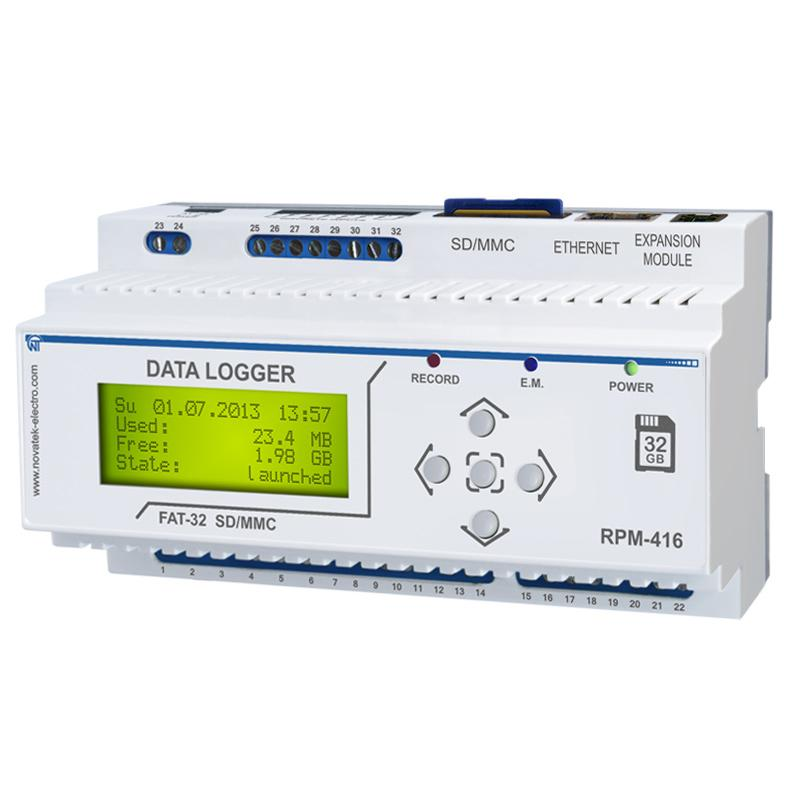

# The RPM-416 configuration for prometheus modbus_exporter

The [RPM-416](https://novatek-electro.com/en/products/recorder-of-electric-process/data-logger-rpm-416.html) can be connected to a facility network via ethernet (modbus/tcp) and send data to the prometheus, for example.

This project contain the modbus.yml file for [modbus_exporter](https://github.com/RichiH/modbus_exporter)
Also i'we wrote simple systemd unit for node exporter. 

Enjoy :)
